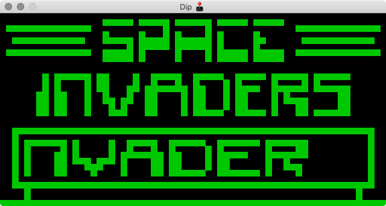

# Dip 🕹

Emulator / interpreter for the CHIP-8 VM.



## Building

Dip depends on [SDL2](https://www.libsdl.org/) and [SDL2_gfx](https://www.ferzkopp.net/wordpress/2016/01/02/sdl_gfx-sdl2_gfx/).

To build under a Debian/Ubuntu based system:

```
apt-get install build-essential libsdl2-dev libsdl2-gfx-dev
```

Under MacOS, assuming you have Homebrew and clang installed, it's:

```
brew install sdl2 sdl2_gfx
```

Windows... I have no idea 🤩

Once you have those installed you should be able to build Dip with `make`.

Then spin it up with:

```
./dip -r [path to rom file]
```
